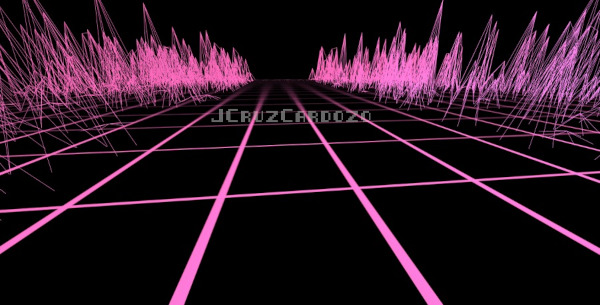
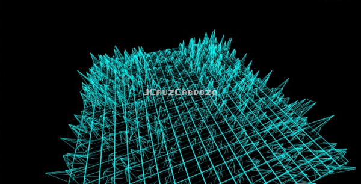
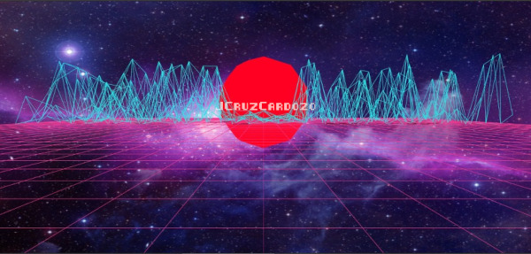
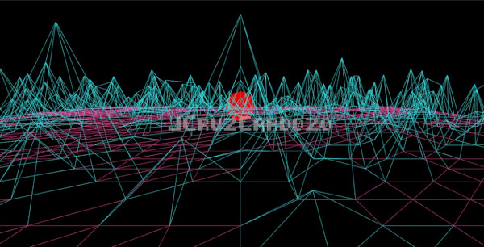
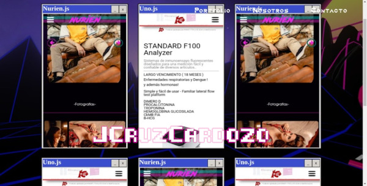

### My Personal Portfolio

## Design inspired by retro synthwave.

Production: [JCruzCardozo.com](jcruzcardozo.com/) (note: screen glitch is an effect, not a bug.)

## Some development's pics

## Tools: 

* [react](https://es.reactjs.org/)
* [react-router-dom](https://www.npmjs.com/package/react-router-dom)
* [styled-components](https://www.npmjs.com/package/styled-components)
* [three.js](https://www.npmjs.com/package/three)
* [react-three-fiber](https://www.npmjs.com/package/react-three-fiber)
* [drei](https://www.npmjs.com/package/drei)
* [react-spring](https://www.npmjs.com/package/react-spring)
* [react-use-gesture](https://www.npmjs.com/package/react-use-gesture)
* [emailjs-com](https://www.npmjs.com/package/emailjs-com)
* [standard](https://standardjs.com/) - linter.
* [vercel](https://vercel.com/) - Hosting
* [@meronex/icons](https://icons.meronex.com/)
